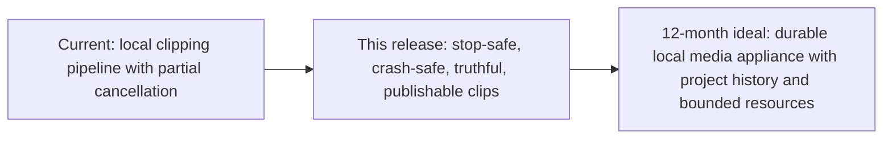

<!-- /autoplan restore point: /Users/bishesha/.gstack/projects/codingwithb-clipping-factory/codex-product-polish-autoplan-restore-20260810-110520.md -->
# Clipping Factory Product Polish Plan

Status: rough plan for GStack review
Branch: `codex/product-polish`
Base: `main`

## Outcome

Make the existing local-first Clipping Factory feel dependable and finished without adding accounts, cloud hosting, or a general-purpose editor. A user should be able to drop in one owned podcast video, understand what the app is doing, cancel work promptly at any stage, review each generated clip, adjust readable caption presentation, and recover cleanly from errors.

## Premises

1. This remains a single-user app running on the owner's device. Authentication and account flows are out of scope.
2. Faithful clips remain contiguous excerpts. Caption controls change presentation, never spoken words or ordering.
3. The existing Rust backend and plain HTML/CSS/JavaScript frontend are the product architecture. A framework rewrite is not required to finish the product.
4. Existing cancellation code is unproven until upload, transcription, selection, framing, rendering, persistence, and UI behavior are tested.
5. Editorial quality must be measured with the existing eval rubric and representative transcripts. We will not claim the algorithm is better from code inspection alone.
6. Product polish means clear hierarchy, readable controls, keyboard/accessibility basics, truthful progress, actionable errors, and consistent recovery states.

## Success Criteria

- `main` remains untouched; all work stays on `codex/product-polish`.
- The app builds and its existing test suite passes before and after changes.
- Upload cancellation stops transfer and removes or marks partial project state safely.
- Processing cancellation becomes visible within a bounded interval and terminates active FFmpeg/Whisper/provider work without starting later stages.
- Refreshing after cancellation shows a truthful cancelled state; retry resumes only safe work.
- Cancellation is idempotent and covered at API, pipeline, and subprocess boundaries.
- Caption controls are easy to discover and support style, font, accent color, and the smallest useful set of readable layout/size choices supported by the renderer.
- Color choices expose readable names/selection state and preserve sufficient contrast.
- Clip cards make preview, source timestamps, rationale, status, restyle, retry, and download clear without crowding the primary actions.
- Empty, uploading, processing, partially complete, cancelled, failed, zero-result, and complete states all have explicit UI behavior.
- The selector/eval harness records baseline and post-change results on representative fixtures; any scoring change is justified by measured precision/quality, not output volume.
- The local studio launches from this branch and is handed to the user at a stable localhost URL with exact test instructions.

## Implementation Slices

### Slice 1: Establish the baseline

- Run `cargo test`, compile the release build, inspect current routes/state transitions, and run the existing eval harness.
- Trace one project from upload through persisted state, including all cancellation token and child-process ownership paths.
- Inventory current UX states and accessibility gaps from the actual running studio.

Verify: baseline test/eval report, architecture map, and reproducible cancellation matrix.

### Slice 2: Cancellation as a product invariant

- Add focused tests that reproduce any cancellation leaks or stale state.
- Make upload abort, pipeline cancellation, child-process termination, state persistence, SSE updates, and retry semantics consistent.
- Disable duplicate actions while cancellation is pending and explain what completed artifacts are retained.

Verify: automated cancellation tests plus live cancellation during at least transcription and rendering with no surviving child process or later-stage transition.

### Slice 3: Finished studio interaction

- Simplify information hierarchy and action labels across upload, processing, and results.
- Make progress, elapsed time, cancel state, failures, partial results, and recovery actions truthful.
- Improve focus states, keyboard operation, contrast, touch targets, responsive behavior, and reduced-motion behavior.

Verify: GStack design review, browser QA at desktop and narrow widths, keyboard pass, and contrast check.

### Slice 4: Caption controls and clip review

- Keep the current post-render restyle architecture and expose a coherent caption control group.
- Support the existing style, font, and accent options; add only renderer-backed size/layout choices that preserve safe areas and legibility.
- Make each clip's current settings, apply progress, playback refresh, and error state obvious.

Verify: unit tests for validation/plumbing, one live restyle per supported option, preview refresh, and output-file verification.

### Slice 5: Editorial quality and performance

- Audit local heuristic scoring, candidate diversity, overlap rejection, opening/closing boundaries, and provider fallbacks.
- Expand representative eval fixtures before changing weights or rules.
- Measure transcription/render cancellation latency, memory-heavy paths, and long-source behavior where practical.

Verify: before/after eval comparison with no regression in faithfulness or diversity, plus benchmark notes for affected hot paths.

### Slice 6: Release readiness

- Run the full Rust tests, evals, formatter/lints, release build, live browser QA, code review, and performance checks.
- Reconcile README screenshots/claims/test counts with verified behavior.
- Launch the branch build locally for user testing. Do not merge to `main`.

Verify: clean branch diff, evidence report, running local URL, and remaining risks listed explicitly.

## Not in Scope

- Login, accounts, teams, payments, hosted storage, or cloud video upload.
- Automatic social posting.
- Rewriting speech, jump-cut editing, timeline editing, B-roll, generated visuals, or music.
- A frontend framework migration unless a concrete blocker is found and separately approved.
- Claiming every possible bug is eliminated; the release bar is no known high-severity bug in tested workflows and explicit documentation of residual risk.

## Initial Risk Register

| Risk | User impact | Required evidence |
|---|---|---|
| Cancellation token does not own every spawned process | Mac keeps working after Cancel | Process and state checks during each stage |
| Upload cancel differs from processing cancel | User cannot stop a mistaken large file | XHR abort and partial-file cleanup test |
| Retry races a still-running task | Duplicate renders or corrupted state | Idempotency and concurrency tests |
| More caption controls create unreadable combinations | Finished clips look worse | Constrained presets, validation, visual QA |
| Selector changes increase quantity but reduce quality | More bad clips | Fixture-based before/after evals |
| UI polish hides technical truth | User cannot tell whether work stopped or failed | State-by-state copy and live QA |

## GStack Phase 1 — CEO Review

Status: `AWAITING PREMISE CONFIRMATION`. Phase 2 design review has not started.

### Premise gate

The implementation plan proceeds only if these product premises are correct:

1. The primary user is the owner/operator processing podcast footage on the same Mac; no login, hosted upload, team, or cloud workspace is needed.
2. The release outcome is a faithful, publishable clip that can be reviewed and downloaded without another tool; reliability and editorial quality outrank the number of features.
3. “Text options” means caption presentation (style, font, size/layout, highlight color, and readability), not rewriting spoken words or building a timeline editor.
4. A clip remains one auditable, continuous source interval. The app never invents, reorders, or splices speech.
5. The existing Rust/Axum and plain HTML/CSS/JavaScript implementation remains the delivery vehicle; there is no framework rewrite unless a proven blocker appears.
6. Reliability is a release gate: later caption and ranking work does not begin until Cancel, retry, crash recovery, and artifact safety are proven.

### Mode and 10x framing

Mode: **Selective expansion**. The product should not compete with cloud editors feature for feature. Its sharper promise is a **private, faithful, auditable local clip compiler**:



The 10x differentiators to make measurable are: video never uploads, every output maps to exact source timestamps, speech is never invented, cancellation becomes quiescent within a bounded time, and retries never trust partial artifacts.

### What already exists

| Sub-problem | Existing leverage | Decision |
|---|---|---|
| Project orchestration | `src/pipeline.rs`, `src/state.rs`, `CancellationToken` | Harden ownership and serialization; do not replace the pipeline wholesale. |
| Subprocess cancellation | `src/util.rs::run_streaming` with kill-on-drop | Reuse for FFmpeg/Whisper; extend the invariant to probe/provider/CPU work. |
| Durable project state | `src/store.rs`, project/transcript/candidate/manifest JSON | Add safe artifact lifecycle and project-scoped write serialization. |
| Upload/progress | Axum multipart in `src/api.rs`, XHR in `static/app.js`, SSE | Add abort/cleanup and truthful preparing/cancelling states. |
| Clip selection | `src/select/`, deterministic `src/validate.rs` | Fix reproduced correctness bugs, then tune only against fixtures. |
| Caption restyle | Two-pass bases, `POST .../restyle`, `src/captions.rs` | Extend the renderer-backed model; no frontend-only fake controls. |
| Clip review | Native previews, rank/reason/timestamps, download/open-folder | Improve state truth, hierarchy, accessibility, and partial-result copy. |
| Evaluation | `evals/run.sh`, rubric scaffold | Turn the scaffold into a real baseline before claiming quality gains. |

### Implementation alternatives

| Approach | Effort | Risk | Advantages | Disadvantages | Decision |
|---|---:|---:|---|---|---|
| A. UI-only patch | Low | High | Fast visible change | Leaves runaway work, partial artifacts, and bad ranking unaddressed | Reject |
| B. Reliability-gated hardening of existing architecture | Medium | Medium | Preserves working code, directly fixes trust, supports incremental proof | Requires careful concurrency and integration tests | **Select** |
| C. New durable job supervisor/desktop rewrite | High | High | Strong long-term appliance model | Large migration and long-lived branch before user value | Defer; borrow only a minimal per-project supervisor concept if tests demand it |

### Scope decisions

Accepted now:

- End-to-end cancellation, safe artifacts, serialized start/cancel/retry, truthful recovery UI.
- Reproduced correctness fixes: Unicode-safe headlines, correct closing-quote occurrence, documented model precedence.
- Real transcript fixtures and a measurable selector baseline before ranking changes.
- Accessible caption presentation and clip review using renderer-backed controls.
- Honest settings verification, errors, partial-result counts, and README/CI claims.

Deferred:

- General timeline editing, B-roll, transitions, generated speech, social posting, analytics, teams, and cloud relay.
- Full recent-project library and Tauri packaging; keep filesystem state compatible with them.
- Transcript word correction and interval nudging unless the premise gate says “text options” includes editing content.
- Import/export integrations beyond finished MP4; consider SRT/transcript/edit-decision export after the core loop is proven.

### Temporal interrogation

| Time | Expected evidence | Stop condition |
|---|---|---|
| Hour 1 | Tests reproduce Unicode, quote matching, model precedence, cancellation state bugs | No implementation without a failing test for each bug |
| Hours 2–6 | Upload abort/cleanup, subprocess/provider cancellation, temp-file writes, serialized actions | Stop if Cancel can acknowledge before work is quiescent |
| Day 2 | Truthful UI state matrix and keyboard/narrow-screen QA | Stop if UI can hide a running project |
| Day 3 | Golden transcript fixtures, baseline, conservative editorial gates | Stop if quality cannot be measured |
| Day 4+ | Caption/readability polish, full review, release build, live media QA | Do not claim finished without real-media evidence |

### CEO dual voices

**Independent subagent:** `DONE_WITH_CONCERNS`. It found an undefined success outcome, six releases hidden in one branch, a missing local/private/faithful product wedge, and a risk that a reliable app still produces clips needing another editor. It recommended hard reliability gates and a publishable-result metric.

**Codex CEO voice:** unavailable after successful auth/version preflight because the local Codex runner binary `/Users/bishesha/.local/bin/codex-code-mode-host` is missing. The phase continues in `[subagent-only]` mode as required by GStack.

| Dimension | Subagent | Codex | Consensus |
|---|---|---|---|
| Premises valid | Concerns | N/A | Flagged for premise gate |
| Right problem | Reliability yes; publishability underspecified | N/A | Flagged |
| Scope calibration | Too broad without release gates | N/A | Reliability gate adopted |
| Alternatives explored | Interoperability missing | N/A | Export path deferred explicitly |
| Competitive risk | Commodity feature race | N/A | Local/private/faithful wedge adopted |
| Six-month trajectory | Risk of dependable intermediate tool | N/A | Publishable outcome added |

### Review Sections 1–11

#### 1. Architecture

The main architectural defect is lifecycle ownership, not technology choice. `running`, the cancellation token, persisted state, output files, and UI actions can disagree. Introduce one serialized project-operation boundary and write reusable artifacts through unique temporary files plus atomic promotion. Keep the current stage modules.

#### 2. Error and rescue

Errors are often stringly typed and UI actions ignore non-2xx responses. Return structured recovery information where needed, preserve the last known-good settings, and expose explicit Retry, Choose another MP4, and Cancel-and-start-over actions.

#### 3. Security and privacy

Local bind/default privacy and transcript-only provider calls are good foundations. Verify provider cancellation and timeouts, never log secrets, test candidate settings before persisting them, and keep video bytes off provider paths. Authentication remains correctly out of scope.

#### 4. Data flow and interaction edges

Audit every transition across empty, uploading, preparing, processing, cancelling, cancelled, failed, partial, zero-result, and complete. A new project must not detach from live work. Refresh/restart must derive truth from persisted state plus the actual running handle.

#### 5. Code quality

Use the minimum new abstraction: a project-scoped operation guard and artifact helper only if the tests show repeated need. Fix the UTF-8 byte-slice panic and repeated-quote lookup directly. Do not refactor unrelated modules.

#### 6. Tests

Baseline is 72/72 passing, but there are no cancellation, API, provider, pipeline-concurrency, actual recovery, or quality-fixture tests. Add focused regression tests first. The README count of 62 is stale.

#### 7. Performance

Cancellation latency is the first performance metric. Provider selection can make up to 24 sequential calls for a four-hour source; full non-range clip responses buffer the complete file. Measure before parallelizing and stream large responses where safe.

#### 8. Observability and debugging

SSE and persisted stage details exist, but cancellation acknowledgements do not mean stopped. Record operation identity/state transitions and make errors actionable. The eval report must include commit, settings, source fingerprint, timeout, and delta.

#### 9. Deployment and rollout

Work stays on `codex/product-polish`; no merge to `main`. Release proof requires format, clippy, tests, eval, release build, browser QA, real-media cancellation, and no surviving child process. The documented CI workflow is not active in `.github/workflows` and must not be claimed as active.

#### 10. Long-term trajectory

Preserve compatibility with a future durable project inbox and desktop shell without building them now. Avoid the incumbent feature race. The moat is local privacy, provenance, reliability, and conservative editorial quality.

#### 11. Design and UX

The studio is visually quiet but too small and semantically weak: 14px body text, 11–13px controls, undersized color targets, no robust dialog focus, limited live-region semantics, and partial results presented as complete. Raise legibility, make action hierarchy state-dependent, and keep caption choices named, constrained, and previewable.

### Error & Rescue Registry

| Failure | Current rescue gap | Required rescue | Verification |
|---|---|---|---|
| Upload aborted | No cancel; orphan directory possible | Abort active XHR; server cleanup; return to import | Throttled abort at 25% and post-upload preparation |
| Cancel during probe/provider/face detect | Work can continue | Token/timeout reaches operation; no later stage starts | Gated fake operations with bounded stop |
| Cancel during FFmpeg output | Partial WAV/base may be reused | Temp output, cleanup, atomic promotion | Write-then-block fake child; retry rebuilds |
| Cancelled UI | Stage remains active; elapsed continues | Terminal cancelled metadata and visible recovery actions | Refresh state snapshot and timer assertion |
| Duplicate Retry/Cancel | Racy mutation/start | Serialized idempotent operation; disabled pending control | Barrier-concurrent API test |
| Failed AI test | Bad settings already saved | Test candidate first; retain last known-good | Invalid key/model test |
| Early failure, zero clips | User trapped on Retry | Choose another MP4 | State-matrix browser test |
| Partial render | Headline implies full success | Ready/failed counts and targeted retry | Mixed-manifest UI test |
| Eval run fails | Harness may treat it as completion | Timeout and terminal status validation | Failed/timed-out fixture run |

### Failure Modes Registry

| Mode | Severity | Prevention/detection |
|---|---|---|
| Cancel signals old token while new run proceeds | P0 | Install/own token atomically under project operation guard |
| Fixed JSON temp path collides across writers | P0 | Project write serialization or unique temp files |
| Truncated WAV/base passes existence check | P0 | Atomic promotion and artifact validity contract |
| Generic filler passes local quality gate | P0 | Golden transcript baseline plus hook/specificity/housekeeping fixtures |
| Unicode headline panics | P1 | Character-boundary truncation test |
| Repeated closing phrase falsely rejects | P1 | Last/all-occurrence validation test |
| New Project hides live render | P0 | Cancel-and-wait or disallow reset while running |
| Restyle rerender loses another clip's busy state | P1 | Persistent per-clip UI operation state |
| Full clip response spikes memory | P1 | Streaming response test and implementation |

### Dream-state delta

This release should end with a trustworthy single-project local studio, not the full local media appliance. Remaining 12-month deltas are recent-project history, resource scheduling, close-browser job supervision, packaging, richer correction/export, and broader real-media golden sets.

### Implementation tasks

| ID | Priority | Task | Proof |
|---|---|---|---|
| T1 | P0 | Serialize project operations and make cancellation acknowledgement mean quiescent | Concurrency/cancellation integration tests |
| T2 | P0 | Abort/clean interrupted upload and distinguish upload from preparation | Throttled multipart tests |
| T3 | P0 | Make WAV/base/final artifacts atomic and retry-safe | Partial-child regression tests |
| T4 | P0 | Build truthful state/recovery UI and safe New Project behavior | Full state matrix + browser QA |
| T5 | P1 | Fix Unicode, quote occurrence, model precedence, settings verification | Focused unit/API tests |
| T6 | P0 | Establish quality fixtures/baseline, then tighten local selector | Before/after scored report |
| T7 | P1 | Finish accessible clip/caption controls using renderer-backed options | Keyboard, contrast, restyle output checks |
| T8 | P1 | Stream large clip responses and bound provider work | Benchmark and request tests |
| T9 | P0 | Full release verification and live branch launch | Test/eval/build/browser/process evidence |

### Phase 1 completion summary

| Area | Result |
|---|---|
| Strategy | Reliability-first local/private/faithful wedge |
| Baseline | 72 tests pass; no real eval baseline |
| Critical product gaps | Cancellation lifecycle, artifact safety, UI truth, generic-filler selection |
| Selected approach | Harden existing architecture behind release gates |
| Outside voices | Subagent completed; Codex degraded due missing local runner host |
| Unresolved decision | Whether “text options” includes transcript-word editing |
| Gate | User premise confirmation required before GStack design/engineering/DX reviews |

## GStack Phase 2 — Design Review

Status: complete. Initial design-spec completeness was **4/10**; the decisions below raise it to **8/10**. A 10/10 still requires live browser validation with real processing/results data. No `DESIGN.md` exists. GStack visual variants were attempted but its designer has no configured API key, so this review used the existing studio, wireframe, screenshots, and universal app-UI principles.

### Screen hierarchy

```text
Persistent header: Clipping Factory identity | local/verified selector status
└── Project workspace
    ├── Empty: Drop/Choose MP4 → summarized output preset → privacy/setup detail
    ├── Active: Current operation + Stop → progress/counts → source/stage history
    ├── Partial: Ready/Rendering/Failed summary → playable ready clips → recovery
    ├── Complete: Outcome + best clip → clip review/restyle → folder/new project
    └── Failed/Stopped: What happened → what was preserved → one recovery + one exit
```

Constraint: one primary action and one secondary escape per state. Import is the dominant empty-state action; framing/accent stay summarized and editable, while provider settings remain secondary because local ranking is usable by default.

### Visible-state contract

| State | What the user sees | Primary | Secondary | Announcement / transition |
|---|---|---|---|---|
| Restoring | “Restoring your last project…”; import hidden | None | None | Polite status; resolve to persisted state or empty |
| Empty | Drop target, Choose MP4, current output summary | Choose MP4 | Adjust output | Focus begins at import; privacy copy is tertiary |
| Uploading | Filename, byte progress, Uploading | Cancel upload | None | Progressbar semantics; abort returns to Empty |
| Preparing | “Upload complete. Preparing project…” | Stop | None | Do not leave the label as Uploading |
| Processing | Plain-language current operation, elapsed time, stage progress | Stop | None | Stop becomes “Stopping…” and disables immediately |
| Reconnecting | Last known state plus “Reconnecting live updates…” | None | Retry connection | Never silently appear frozen |
| Partial | “X ready, Y rendering, Z failed”; ready previews first | Review ready clips | Retry failed clips | Never use complete-result wording |
| Stopped | “Stopped. X finished clips were kept.” | Resume safely | Choose another MP4 | Shown only after work is quiescent |
| Failed | What failed, why, preserved artifacts | Retry when safe | Choose another MP4 | Error receives focus; no retry-only trap |
| Zero result | Quality bar protected the user; rejection summary | Choose another MP4 | Review rejections | Avoid blame or “nothing found” dead end |
| Complete | Outcome count, best clip, saved location | Review/download | Open folder / New project | Success status; preview must play |

New Project during live work means **Cancel and start over**: request stop, wait for quiescence, then reset. Results may appear as soon as a clip is ready, but only under the Partial heading.

### Caption control contract

Per-clip only for this release. State machine: `idle → changed → applying → applied` or `error`. Apply is disabled when unchanged, reads **Apply captions**, persists busy state across rerenders, and announces success only after the refreshed preview can load. Ship existing renderer-backed style/font/color choices; defer new size/layout presets until the renderer contract is implemented and tested.

### User journey and emotional arc

| Step | User does | Intended feeling | Design support |
|---|---|---|---|
| Import | Drops one owned podcast | Confidence | One dominant action; local/privacy promise |
| Configure | Reviews a small preset summary | Agency without homework | Progressive disclosure and safe defaults |
| Wait | Watches a long local job | Patience and orientation | Current operation, elapsed time, truthful progress |
| Stop | Cancels mistaken/unwanted work | Control | Immediate Stopping state; terminal proof of what was kept |
| Review | Plays ranked clips | Informed judgment | Preview, exact timestamps, rationale, partial truth |
| Restyle | Changes caption presentation | Creative control | Named constrained choices and fast feedback |
| Finish | Downloads or opens the folder | Satisfaction | Playable output and visible save location |

Time horizons: in five seconds the current state/action is obvious; in five minutes long work remains understandable and stoppable; over repeated use the app earns trust through conservative quality and exact provenance.

### Seven-pass scorecard

| Pass | Before | After | Auto-decision |
|---|---:|---:|---|
| Information architecture | 4 | 9 | Lock state-specific first/second/third hierarchy |
| Interaction coverage | 5 | 9 | Adopt the visible-state contract above |
| Journey/emotional arc | 3 | 8 | Add trust/control storyboard; validate copy live |
| AI-slop risk | 8 | 9 | Keep quiet task-focused layout; reject card grids, gradients, decorative icons, and generic SaaS copy |
| Design-system alignment | 4 | 7 | Use existing paper/ink tokens; add explicit type/spacing/focus rules without a rebrand |
| Responsive/accessibility | 5 | 9 | Mac desktop first plus intentional 320/375/768 widths and short-height behavior |
| Unresolved decisions | 4 | 8 | Resolve state actions and per-clip scope; renderer size/layout remains explicitly deferred |

### Visual baseline

- App UI, not a landing page: quiet surfaces, minimal chrome, one restrained amber accent, semantic success/error colors.
- Body and controls are at least 16px; secondary metadata may be smaller only when nonessential and AA compliant.
- 4px/8px spacing rhythm; modest borders/radii; no decorative shadows or gradients.
- Every interactive target is at least 44px; `:focus-visible` is unmistakable.
- Long filenames wrap; modal content scrolls in short viewports; clip rows become a deliberate single column on narrow screens.
- Motion is limited to useful progress feedback and obeys `prefers-reduced-motion`.

### Design dual voice

Independent product-design subagent: 12 findings, including unspecified screen hierarchy, missing degraded states, cancellation not designed as a trust moment, and a slice order that separated backend truth from visible proof. Codex design voice remained unavailable because the local code-mode host is missing. Degradation: `[subagent-only]`.

| Litmus dimension | Subagent | Codex | Result |
|---|---|---|---|
| Product/state unmistakable | Concern before hierarchy | N/A | Resolved in plan |
| One visual anchor | Current operation recommended | N/A | Adopted |
| Scannable hierarchy | Critical gap | N/A | Adopted |
| One job per section | Empty screen too choice-heavy | N/A | Progressive disclosure adopted |
| Cards necessary | Clip card is the interaction | N/A | Keep; reject decorative cards |
| Motion purposeful | Reduced to progress/status | N/A | Adopted |
| Premium without decoration | Yes with typography/spacing fixes | N/A | Adopted |

**Phase 2 complete.** Subagent: 12 issues. Codex: unavailable. No model disagreement; structural issues were auto-decided. Passing to Phase 3.

## GStack Phase 3 — Engineering Review

Status: complete. Review was performed against the actual code and the in-progress Luna reliability diff. The current compile errors are expected red-phase findings and must be green before integration.

### Scope challenge and chosen architecture

Do not add a second job system. Deepen the existing `AppState`/`ProjectHandle` boundary so one generation owns its token, completion signal, persistence mutations, and artifact lifecycle.

```text
Browser (XHR + fetch + SSE)
        │
        ▼
Axum API ── input/body/bind policy
        │
        ▼
AppState
  ├── global admission semaphore (bounded heavy jobs)
  └── ProjectHandle
       ├── operation mutex / generation
       ├── CancellationToken + bounded completion
       ├── project mutation serialization
       └── event broadcast
                │
                ▼
Pipeline stages
  probe → extract → transcribe → select → validate → frame → render
                │                           │
                ├── cancellable processes/HTTP/CPU work
                └── temp artifact → validate → atomic promote
                │
                ▼
Store (project/transcript/candidates/manifest) + output directory
```

The API/UI contract must distinguish **signal accepted**, **stopping**, and **quiescent stopped**. Panics and timeouts must still release the generation through an RAII/finalizer path.

### Independent engineering voice

The subagent reported eight issues: current in-progress async caller compile breaks, unbounded cancel waits, project-write serialization gaps, unsafe/unbounded upload, missing 10x admission control, full-file response buffering, `CF_BIND_ALL` exposure without auth, and missing injectable/router/browser test seams. Codex engineering voice is unavailable because the local code-mode host is missing. Degradation: `[subagent-only]`.

| Dimension | Subagent | Codex | Result |
|---|---|---|---|
| Architecture sound | Existing modules sound; lifecycle boundary incomplete | N/A | Harden existing boundary |
| Test coverage sufficient | No | N/A | Test diagram adopted |
| Performance risks addressed | No: concurrency and buffering | N/A | Admission/streaming tasks added |
| Security threats covered | No: bind-all unauthenticated | N/A | Disable bind-all for release or token-gate |
| Error paths handled | No: panic/hang/upload cleanup | N/A | Finalizer/deadline/cleanup required |
| Deployment risk manageable | Yes only behind release gates | N/A | No merge until green/live proof |

### Code-quality decisions

- One explicit project-operation mechanism is preferable to independent booleans/locks for start, cancel, retry, recovery, and restyle writes.
- Unique temp outputs plus atomic promotion replace existence-as-validity; do not add format-specific validation in every caller.
- Keep errors structured at API boundaries but avoid a repository-wide error rewrite.
- Preserve current module names and plain frontend. Remove only dead code introduced by these changes.

### Test diagram

| New flow/codepath | Branches to prove | Test type | Required |
|---|---|---|---|
| Upload lifecycle | success, abort, oversize, empty, corrupt, disk error | Axum multipart integration | P1 |
| Start/cancel ownership | cancel-before-start, during-start, duplicate cancel, panic, timeout | Tokio concurrency/integration | P1 |
| Retry lifecycle | running conflict, double retry, cancelled retry, interrupted restart | Tokio + persisted-state integration | P1 |
| Artifact promotion | child fails/cancels after writing, rename fails, valid reuse | Fake process/filesystem integration | P1 |
| Probe/transcribe/select/frame/render | cancel before/during/after each, no next stage | Injectable stage/process tests | P1 |
| Provider selection | timeout, token cancel, late-window failure, no later billed request | Mock HTTP server | P1 |
| Store/restyle writes | parallel restyles, retry+restyle, recovery+save | Barrier concurrency | P1 |
| Job admission | ten starts, queued cancel, bounded child count | Semaphore integration | P2 |
| Clip serving | full, bounded range, suffix/open range, invalid 416, parallel clients | Router/stream tests | P2 |
| Studio state matrix | restore, upload, prepare, process, reconnect, partial, stop, fail, zero, complete | Browser DOM/network tests | P1 |
| Caption controls | dirty, no-op, applying, success, error, concurrent clips | Browser/unit seam | P2 |
| Local selector | filler, sponsor, insight, Unicode, repeated quote, containment overlap | Rust fixture tests | P1 |
| Eval harness | timeout, failed terminal, provenance, baseline/delta | Shell fixture tests | P1 |
| Network boundary | loopback default, bind-all rejection/token, origin | Startup/router tests | P1 |

### Performance and security decisions

- Add a small configurable semaphore for heavy pipelines now; a queueing product UI may be deferred, but direct API calls must not spawn unbounded FFmpeg/Whisper work.
- Stream full/range clip responses in bounded chunks; malformed or unsatisfiable ranges return `416` rather than silently serving the full clip.
- The release remains loopback-only. `CF_BIND_ALL` is disabled/removed unless every API/SSE route gains a generated token and origin restriction; authentication remains unnecessary on loopback.
- Uploads get a route-specific maximum, disk-space preflight, temporary destination, cleanup guard, and media validation before promotion.

### Failure-mode critical gaps

| Gap | Severity | Ship gate |
|---|---|---|
| Async start/cancel callers or missing Store helper leave branch uncompilable | P0 | `cargo check`/clippy/test green |
| Cancel waits forever after panic or uncancellable stage | P0 | Deadline/finalizer/cancel tests |
| Concurrent pipeline/restyle/recovery writes lose state | P0 | Project mutation + barrier tests |
| Aborted/oversize upload exhausts disk or leaves project | P0 | Upload integration tests |
| Direct API calls spawn unbounded heavy work | P1 | Admission-limit test |
| Full clip downloads multiply RAM per client | P1 | Streaming/range tests |
| Bind-all exposes private local operations | P1 | Loopback-only startup proof |

### Engineering completion summary

| Area | Decision |
|---|---|
| Component structure | Keep existing modules; deepen ProjectHandle ownership |
| Hidden complexity | Cancellation is a distributed lifecycle, not a button/token |
| 10x load | Bound heavy jobs and response memory |
| Security | Loopback only; body/disk bounds; no auth flow |
| Testing | Add seams only where needed to prove stage/process/router behavior |
| Rollout | Reliability vertical slice → correctness/eval → UI/captions → live release proof |

**Phase 3 complete.** Subagent: eight issues. Codex: unavailable. Passing to Phase 3.5.

## GStack Phase 3.5 — Developer Experience Review

Mode: **DX POLISH**. Primary persona: a Mac creator/operator comfortable pasting terminal commands but not debugging Rust/media toolchains. Initial DX completeness: **5/10**.

### Developer journey

| Stage | Current experience | Target |
|---|---|---|
| 1. Discover | README explains local-first product | Keep promise concise and evidence-qualified |
| 2. Prerequisites | Homebrew/Rust assumptions are implicit | Supported OS and prerequisites stated first |
| 3. Obtain | Clone/`cd` missing from Quickstart | One copy-paste block from clone to launch |
| 4. Install runtimes | Multiple package/tool steps | One bootstrap/doctor path with manual fallback |
| 5. Install model | Separate 148 MB command | Doctor reports exact path and copy-paste fix |
| 6. Launch | `cargo run --release`; long first build | Expected output and URL; repeat launch under five minutes |
| 7. First success | Requires the user’s own MP4 | Tiny owned/synthetic smoke option plus clear empty state |
| 8. Diagnose | Setup banner has partial checks | `doctor`-quality problem + cause + fix messages |
| 9. Upgrade/rollback | Unspecified | Versioned state, backup, changelog, rollback/export guidance |

### Developer empathy narrative

“I want a local clipping tool, not a Rust project. I can paste commands, but I need to know prerequisites before a long build, see exactly which dependency or model is missing, and get one visible success without diagnosing FFmpeg flags. If an upgrade touches my projects, I need a backup and a way back. The HTTP API should either be clearly internal or documented consistently; half-documented endpoints make me afraid to depend on it.”

### TTHW

Cold clean-machine TTHW is likely **15–30+ minutes** because Homebrew packages, Rust, model download, compilation, and a user video are required. Warm repeat launch is under five minutes. This source release targets **under 10 minutes cold with an existing Rust toolchain and under five minutes warm**; a packaged desktop build is the later path to true under-five-minute cold start.

### DX scorecard

| Dimension | Score | Required improvement |
|---|---:|---|
| Getting started | 4/10 | Complete clone-to-launch blocks and prerequisites |
| Time to first success | 3/10 | Doctor + small legal smoke source/path |
| API/CLI ergonomics | 6/10 | Mark API internal or publish one consistent contract |
| Error quality | 5/10 | Problem + cause + fix + retryability; stable codes where useful |
| Documentation | 6/10 | Reconcile claims, config table, troubleshooting |
| Defaults/escape hatches | 6/10 | Explain precedence; remove unsafe bind-all escape hatch |
| Upgrade safety | 2/10 | Versioned state, backup, migration, rollback |
| Dev environment | 6/10 | Doctor/checks; keep single Rust binary architecture |

Overall: **4.8/10** now, target **8/10** for the source release.

### DX decisions and checklist

- [ ] Quickstart includes Homebrew prerequisite, clone, `cd`, Rust shell activation, model, launch, expected URL, and common failure checks.
- [ ] Setup/doctor output names the problem, likely cause, exact command/path to fix, and whether restart is needed.
- [ ] README claims reflect verified test count, active CI reality, and measured cancellation/recovery behavior.
- [ ] `CF_*` configuration is a table with type/default/allowed value/precedence/example.
- [ ] `/api/*` is explicitly internal/unstable for this release; remove isolated endpoint marketing unless a compact reference is added.
- [ ] `CF_BIND_ALL` is removed/disabled for the unauthenticated local release.
- [ ] Persisted state carries a schema/app version and is backed up before migration; rollback/export is documented before packaging.

### DX dual voice

The independent DX subagent reported eight issues: slow/ambiguous TTHW, incomplete clean-machine Quickstart, claims that contradict evidence, no error contract, unclear API support, opaque configuration, unsafe bind-all, and no upgrade/rollback story. Codex DX voice is unavailable because the local code-mode host is missing. Degradation: `[subagent-only]`.

| Dimension | Subagent | Codex | Result |
|---|---|---|---|
| Getting started under 5 min | No | N/A | Source target calibrated; packaged path deferred |
| Naming guessable | Mixed | N/A | Mark HTTP API internal |
| Errors actionable | No | N/A | Message contract adopted |
| Docs complete/findable | No | N/A | Quickstart/config/troubleshooting tasks adopted |
| Upgrade safe | No | N/A | Version/backup requirement added |
| Environment friction-free | No | N/A | Doctor/bootstrap direction adopted |

**Phase 3.5 complete.** Overall DX: 4.8/10 → 8/10 target. Cold TTHW: 15–30+ minutes → under 10 source target; warm target under five. Subagent: eight issues. Codex: unavailable. Passing to integration and release verification under the user’s explicit implementation approval.

## Cross-phase themes

1. **Truth is the product.** CEO, design, engineering, and DX independently found that claims, visible states, persisted state, and actual work can disagree.
2. **Reliability must be vertical.** Design and engineering both require backend quiescence, artifact safety, and user-visible stopping/recovery to land together.
3. **Evidence before claims.** CEO/editorial, engineering, and DX found empty evals, stale test/CI claims, and missing live proof.
4. **Avoid the feature race.** Strategy and design converge on a quiet local/private/faithful tool with constrained caption presentation, not a cloud editor clone.

## Decision Audit Trail

| # | Phase | Decision | Classification | Principle | Rationale | Rejected |
|---|---|---|---|---|---|---|
| 1 | CEO | Local/private/faithful compiler is the product wedge | Auto | Completeness | Defensible and matches explicit no-auth/local premise | Cloud feature race |
| 2 | CEO | Reliability is a hard gate before ranking/caption polish | Auto | Simplicity | Prevents six unfinished releases in one branch | Parallel feature completion without proof |
| 3 | CEO | Keep Rust/plain frontend | Auto | Leverage | Existing modules are sound enough; no blocker supports rewrite | Framework/desktop rewrite |
| 4 | Design | One primary action plus one escape in every state | Auto | Simplicity | Removes competing controls and dead ends | Showing every available action |
| 5 | Design | Partial clips appear early only under truthful counts | Auto | Completeness | Preserves useful output without implying completion | Hide all clips or claim full success |
| 6 | Design | Caption editing is per-clip presentation only | User-confirmed | User premise | User approved implementation after premise gate | Transcript/timeline editing |
| 7 | Design | Mac desktop first with intentional narrow widths | Auto | Completeness | Local product reality plus accessibility | Desktop-only overflow or arbitrary stacking |
| 8 | Eng | Deepen ProjectHandle lifecycle instead of new job system | Auto | Simplicity | Smallest architecture that centralizes truth | Second orchestration framework |
| 9 | Eng | Unique temp artifacts and atomic promotion | Auto | Safety | Existence cannot prove completeness | Reuse direct-to-final partial files |
| 10 | Eng | Bound heavy jobs and stream clip responses | Auto | Completeness | Prevents 10x resource collapse | Unbounded direct API concurrency |
| 11 | Eng | Loopback-only release | Auto | Safety | No auth is safe only at the local boundary | Unauthenticated bind-all |
| 12 | DX | Mark HTTP API internal for this release | Auto | Simplicity | Avoids accidental compatibility promises | Partial public API documentation |
| 13 | DX | Source TTHW target under 10 cold, under 5 warm | Taste | Practicality | Packaging is out of this slice | Pretending source install is under five |
